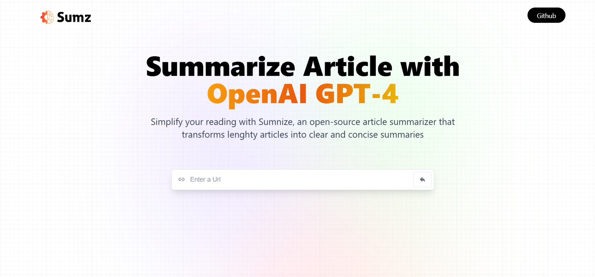

<div align="center">
<a href="https://openai-cm.netlify.app/" target="_blanck"></a>
  <div align="center">
    
    
    
    
  </div>

  <h3 align="center">An AI Article Summarizer Website with ChatGPT-4</h3>

</div>

## 📋 <a name="table">Table of Contents</a>

- ✨ [Introduction](#introduction)
- 🛠 [Technology Used](#tech-stack)
- 🔋 [Features](#features)
- 🚀 [Launch App](#launch-app)
- 🎨 [Styling](#style)

## <a name="introduction">✨ Introduction</a>

**[ENG]** This AI-powered article summarizer website uses ChatGPT-4 to instantly generate concise summaries of any article with just one click. By integrating RapidAPI, the platform ensures smooth API calls for quick and accurate summarization. The site offers a clean, modern user interface, built with React and TailwindCSS, providing a seamless experience for users. Whether it's summarizing lengthy articles or saving a history of previous summaries, this website streamlines the process, making it easy for users to access and share content efficiently.

**[FR]** Ce site web de résumé d'articles alimenté par l'IA utilise ChatGPT-4 pour générer instantanément des résumés concis de n'importe quel article en un clic. Grâce à l'intégration de RapidAPI, la plateforme optimise les appels API pour une summarisation rapide et précise. L'interface moderne et épurée, construite avec React et TailwindCSS, offre une expérience fluide à l'utilisateur. Que ce soit pour résumer des articles longs ou sauvegarder l'historique des résumés précédents, ce site simplifie le processus, facilitant l'accès et le partage du contenu.


## <a name="tech-stack">🛠 Tech Stack</a>

- [react-redux](https://react-redux.js.org/introduction/getting-started)
React Redux is the official React UI bindings layer for Redux. It lets your React components read data from a Redux store, and dispatch actions to the store to update state.

- [Redux_Toolkit](https://redux-toolkit.js.org/introduction/getting-started)
  Redux Toolkit is a JavaScript library that enhances Redux application development by providing pre-built tools and features, such as code generators, hooks, and reducers, to improve efficiency and maintainability.

- [TailwindCSS](https://tailwindcss.com/docs/installation)
  Tailwind CSS is a valuable tool for developers who want to build modern, responsive, and visually appealing websites without sacrificing development speed.

  - [react-icon](https://www.npmjs.com/package/react-icons)
Include popular icons in your React projects easily with react-icons, which utilizes ES6 imports that allows you to include only the icons that your project is using.

- [RAPID_API](https://docs.rapidapi.com/docs/navigating-this-documentation)
Platform that provides access to thousands of APIs through a single unified platform. Allows developers to discover, connect, and manage APIs in one place, simplifying the process of integrating third-party APIs into applications.

## <a name="features">🔋 Features</a>

👉 **Modern User Interface**: A modern and user-friendly interface, offering an intuitive experience for users.

👉 **Summary Generation**: Users can input the URL of a lengthy article, and the web app utilizes AI to provide a concise summary of the article content.

👉 **History Saving with Local Storage**: The app includes a history feature, allowing users to save summaries locally, providing a convenient way to revisit and manage their reading history.

👉 **Copy to Clipboard Functionality**: Enables users to easily share or store the summarized content by copying it to their clipboard.

👉 **Advanced RTK Query API Requests**: Utilizes the advanced capabilities of Redux Toolkit (RTK) Query for making API requests. These requests fire conditionally based on specific criteria, optimizing data fetching and management.

and many more, including code architecture and reusability

## <br /> <a name="launch-app">🚀 Launch App</a>

Follow these steps to set up the project locally on your machine.

> [!IMPORTANT]
> Make sure you have the following installed on your machine:
>
> - [Git](https://git-scm.com/)
> - [Node.js](https://nodejs.org/en)
> - [npm](https://www.npmjs.com/) (Node Package Manager)

**Cloning the Repository**

```bash
git clone {git remote URL}
cd {git project..}
```

**Installation**

> After cloning the repository, run the command `npm i` or `yarn i` to install the project's dependencies.

_npm_

```
npm install 
```

_yarn_

```
yarn install
```

> Once the dependencies are installed, start the project with the command `npm run dev`.

**Set Up Environment Variables**

Create a new file named `.env` in the root of your project and add the following content:

```env
VITE_RAPID_API_ARTICLE_KEY=
```

Replace the placeholder values with your actual credentials. You can obtain these credentials by signing up on the [Rapid API website](https://www.youtube.com/redirect?event=video_description&redir_token=QUFFLUhqbnl0Y19rRTVjYWNwVTZjSmR5QzBYQVF5cXJmUXxBQ3Jtc0tuS1prb052VWw2ZmdzcVhCeGpzS3MtTWNxUnVWNjZjMFR5akxFLThFNjlLcW5IaGd5QkR5ZkxXQVYxdVljZFBRTzV1TWN4dktRblUtenlGQ21RcHoxcGgtTEhKREh1STB6LWFfcnVKaTJIandrRWFsYw&q=https%3A%2F%2Frapidapi.com%2Frestyler%2Fapi%2Farticle-extractor-and-summarizer%3Futm_source%3Dyoutube.com%2FJavaScriptMastery%26utm_medium%3Dreferral%26utm_campaign%3DDevRel&v=vpvtZZi5ZWk).

## <br /> <a name="style">🎨 Styling</a>

Global styling are defined using **CSS** & **TailwindCSS**

<details>
<summary><code>App.css</code></summary>

```css
:root {
  --radicalGradient-pattern:radial-gradient(
    at 27% 37%,
    hsla(215, 98%, 61%, 1) 0px,
    transparent 0%
    ),
  radial-gradient(at 97% 21%, hsla(125, 98%, 72%, 1) 0px, transparent 50%),
  radial-gradient(at 52% 99%, hsla(354, 98%, 61%, 1) 0px, transparent 50%),
  radial-gradient(at 10% 29%, hsla(256, 96%, 67%, 1) 0px, transparent 50%),
  radial-gradient(at 97% 96%, hsla(38, 60%, 74%, 1) 0px, transparent 50%),
  radial-gradient(at 33% 50%, hsla(222, 67%, 73%, 1) 0px, transparent 50%),
  radial-gradient(at 79% 53%, hsla(343, 68%, 79%, 1) 0px, transparent 50%);
  --radicalGradient-main:radial-gradient(circle, rgba(2, 0, 36, 0) 0, #fafafa);
}

@tailwind base;
@tailwind components;
@tailwind utilities;

* {
  margin: 0;
  padding: 0;
  box-sizing: border-box;
  scroll-behavior: smooth;
}
.main {
  width: 100vw;
  min-height: 100vh;
  position: fixed;
  display: flex;
  justify-content: center;
  padding: 120px 24px 160px 24px;
  pointer-events: none;
} 

.main:before {
  position: absolute;
  content: "";
  z-index: 2;
  width: 100%;
  height: 100%;
  top: 0;
}

.main:after {
  content: "";
  background-image: url("/src/assets/grid.svg");
  z-index: 1;
  position: absolute;
  width: 100%;
  height: 100%;
  top: 0;
  opacity: 0.4;
  filter: invert(1);
}

.gradient {
  height: fit-content;
  z-index: 3;
  width: 100%;
  max-width: 640px;
  background-image: var(--radicalGradient-pattern);
  position: absolute;
  content: "";
  width: 100%;
  height: 100%;
  filter: blur(100px) saturate(150%);
  top: 80px;
  opacity: 0.15;
}

@media screen and (max-width: 640px) {
  .main {
    padding: 0;
  }
}
```

</details>

<details>
<summary><code>tailwind.config.js</code></summary>

```cjs
/** @type {import('tailwindcss').Config} */

export default {
  content: [
    "./index.html",
    "./src/**/*.{js,ts,jsx,tsx}",
  ],
  theme: {
    extend: {
      fontFamily: {
        satoshi: ['Satoshi', 'sans-serif'],
        inter: ['Inter', 'sans-serif'],
      },
    },
  },
  plugins: [],
}
```
</details>
